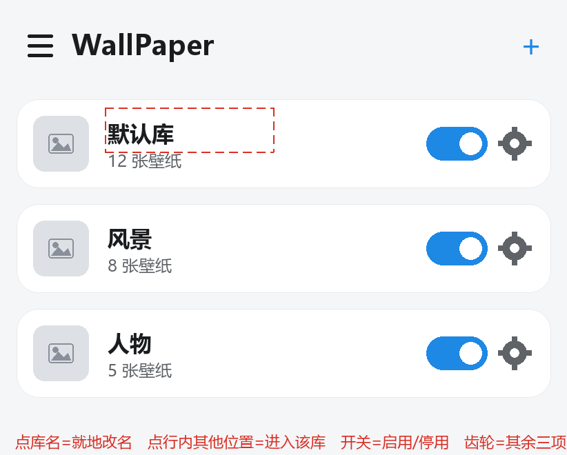
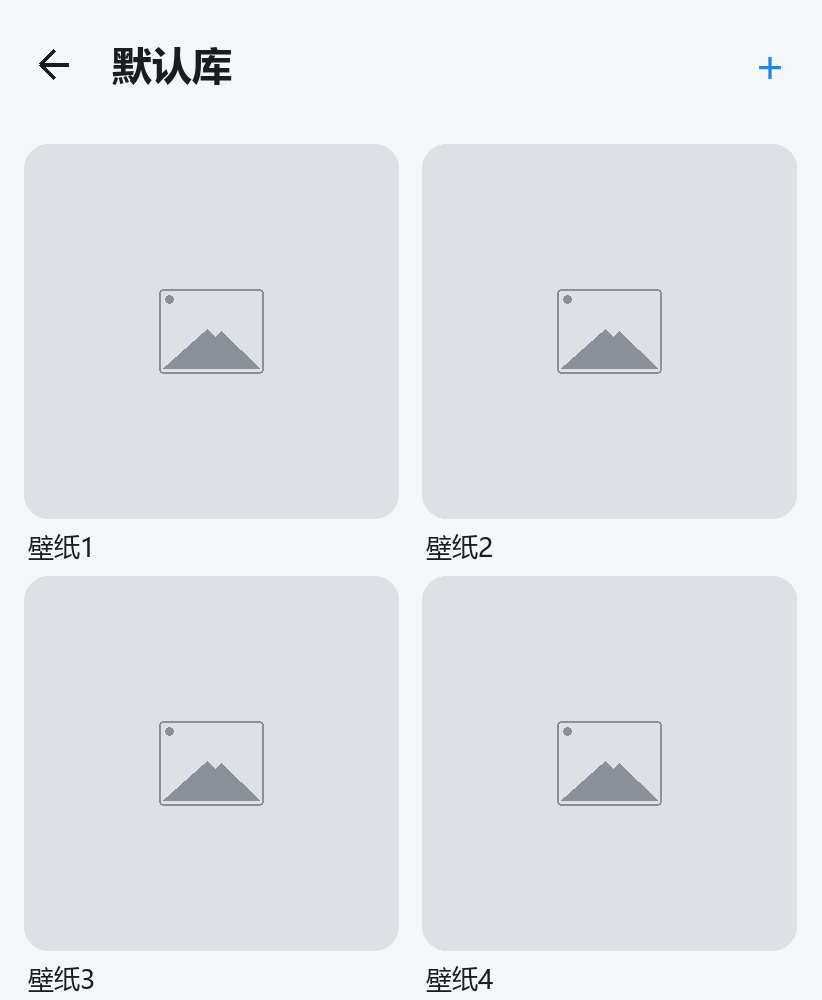
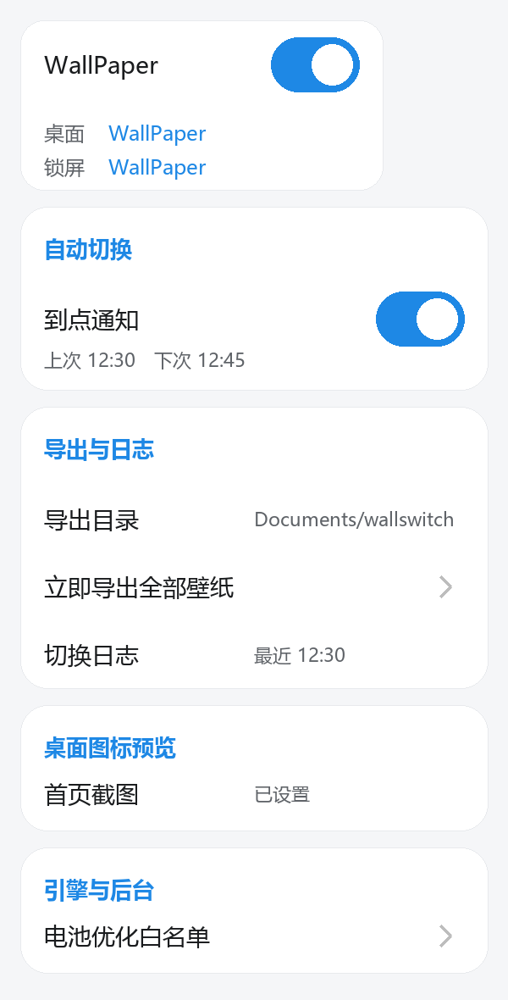
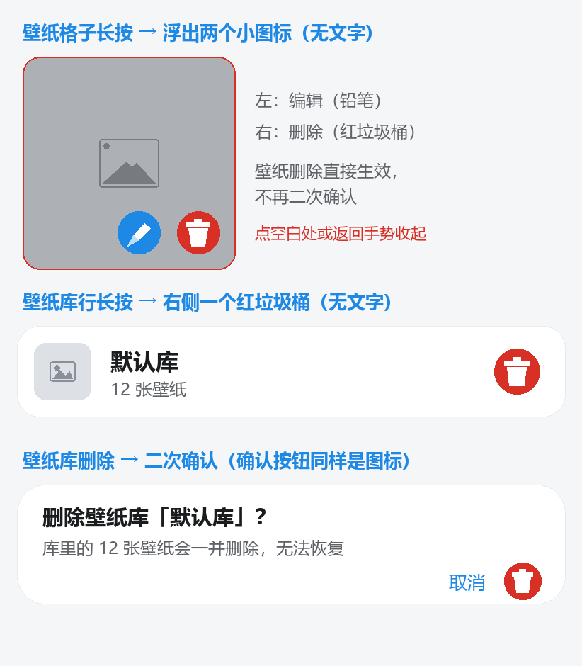
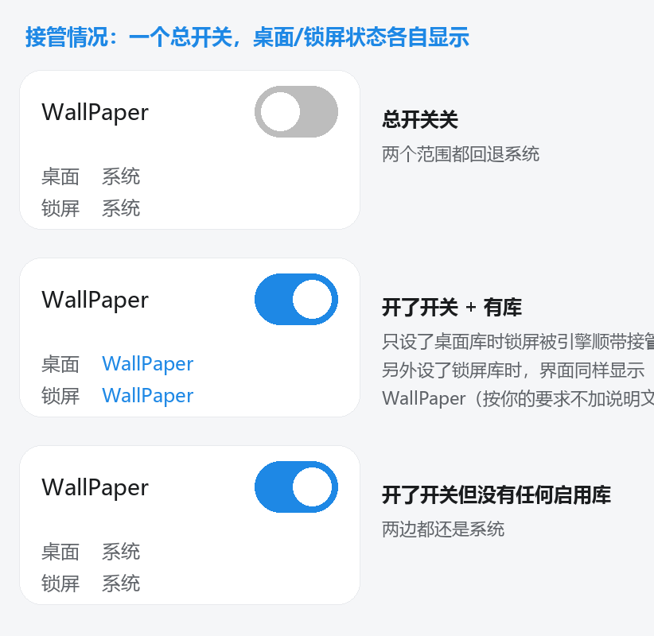

# UI 改造方案 —— 给实现者（GLM）的交接文档

> **状态：方案已定，代码未实现。** 本文档 + `docs/mockups/` 的 5 张原型图就是完整需求。
> 原型图是**最终形态**（不是参考），实现完成后界面应与图一致。
> 文档基于 `v3.13`（commit `d616a38`）的代码状态撰写。

---

## 0. 先做三件事

1. **读 `AGENTS.md`**（仓库根目录）。里面的强制规矩：每次提交 `versionCode +1`、
   `versionName` 次版本 +1；改完必须跑 `check/check.cmd`；提交信息写中文；
   **未经用户确认绝不 `git push`**；不擅自引入新依赖。
2. **看 `docs/mockups/` 的 5 张图**（下文第五节逐图对应）。图是脚本渲染的，可重跑：
   `python docs/mockups/render.py`（需要 Pillow；色值字号取自 `colors.xml`）。
3. **看第九节「这个仓库踩过的坑」**。那几条都是已经真实踩爆过的，能省你很多时间。

---

## 一、这次改造要解决什么

现状是**单页应用**：主界面直接就是「当前库的壁纸列表」，库的切换与管理全塞在左侧抽屉里
（库选择下拉 + 启用/停用 + 作用范围 + 切换模式 + 切换间隔），壁纸靠**左滑**删除，删库藏在
顶栏溢出菜单。库一多，切库要先进抽屉拉下拉，层级关系（库 → 壁纸）在界面上完全看不出来。

改造的核心就一句：**把层级搬到界面上** —— 首页是库，点进去才是壁纸。

---

## 二、现状代码地图（v3.13）

| 文件 | 职责（与本次改造相关的部分） |
| --- | --- |
| `MainActivity.java`（1441 行） | **改造主战场**。单 Activity + `DrawerLayout` + `Toolbar`。关键成员：`setupDrawer()`(163) 接线抽屉各行、`setupLibViews()`(310) 库选择下拉、`refreshLibSettings()`(471) 回填库级设置、`refreshSwitchButton()`(398)、`refreshList()`(827) 刷新壁纸列表、`confirmDelete(WallpaperStore.Item)`(1008) **壁纸删除确认**、`confirmDeleteLib()`(724) **删库确认**、`Adapter`(1336) 壁纸列表适配器、`ViewHolder`(1424) |
| `activity_main.xml` | `drawer_layout`(DrawerLayout) 内含 `main_root`（Toolbar + `recycler` + `empty_state` + `btn_switch`）与 `drawer_content`（300dp 抽屉，5 张卡片） |
| `item_wallpaper.xml` | 壁纸行布局：外层 `SwipeRevealLayout`（左滑露出 `item_actions` 删除区）+ `item_content` 卡片（`img_thumb` 44dp + `tv_wallpaper_title`） |
| `SwipeRevealLayout.java`（147 行） | **项目自写的**左滑露出控件（不是第三方库），本次改造后可能不再需要 |
| `LibraryStore.java` | 壁纸库持久化（JSON）。`Library{id, name, home, lock, enabled, mode, intervalSeconds}`；`setScope/setEnabled/setMode`、`enabledLibForScope(ctx, forHome)`（同范围只允许一个库启用的互斥在这里） |
| `WallpaperStore.java` | 壁纸文件的入库/缩略图/全图（无损 PNG）与解码（`decodeBounded`/`decodeRegion`） |
| `Switcher.java` | **切换核心**。`next(ctx, libId, forHome)` 是**所有上屏路径的唯一收口**（手动/定时/小组件/引擎首帧都走它），开头拦「接管关着」 |
| `TimerScheduler.java` | WorkManager 定时 + 补切 + 记账（`last_run_` / `last_result_` / `next_trigger_`）；`runNow()` 里「接管关着」直接跳过 |
| `TakeoverManager.java` | 接管总开关、桌面/锁屏**各自**存档与还原、锁屏 `setBitmap(FLAG_LOCK)`、`isHomeTakenOver()`/`isLockTakenOver()` |
| `SwitchLog.java` | 切换日志 `files/switch_log.txt`（只记定时自动切换成功，按 `versionName` 分段），并同名同步一份到导出目录 |
| `WallpaperExporter.java` | SAF 导出目录；`exportAll()`、`writeTextFile()`（日志同步） |
| `WidgetProvider.java` / `SwitchWorker.java` / `BootReceiver.java` / `SwitchNotifier.java` | 小组件、定时 Worker、开机补切、通知 |
| `WallSwitchService.java` | 动态壁纸引擎（Canvas 直接渲染）。**它同时盖住桌面和锁屏** |
| `EditActivity.java` / `CropView.java` | 裁剪编辑页（长按壁纸格的"铅笔"要跳到这里） |
| `LauncherPreviewOverlay.java` | 首页截图叠加层（裁剪页用） |
| `check/check.cmd` + `check/stubs/` | 本地 javac 类型检查（含手写桩）；见第九节第 1 条 |
| `.github/workflows/build.yml` | CI：`gradle assembleDebug` + 发滚动的 `latest` Release（手机直链下裸 apk） |

**`activity_main.xml` 现有的全部 id**（改造时会动到不少）：
```
btn_add btn_battery btn_switch drawer_content drawer_layout empty_state lib_selector
main_root rb_order rb_random recycler rg_mode row_export_dir row_export_now row_interval
row_launcher_overlay row_switch_log scope_selector sw_auto_notify sw_lib_enabled sw_takeover
sw_timer_enabled til_lib til_scope toolbar tv_engine tv_export_dir tv_interval
tv_launcher_overlay tv_switch_log tv_takeover_home tv_takeover_lock tv_timer_status tv_version
```

---

## 三、目标形态（逐页）

### 3.1 首页 = 壁纸库列表（`mockups/1_home.png`）

```
☰  WallPaper                                             ＋
─────────────────────────────────────────────────────────────
[缩略图]  默认库                          [启用开关]  [齿轮]
          12 张壁纸
[缩略图]  风景                            [启用开关]  [齿轮]
          8 张壁纸
...
```

- 顶栏：☰ 开抽屉、标题固定为 **`WallPaper`**（不再是库名/版本号）、右侧 ＋ 新建库
- 每行：缩略图（该库当前壁纸）+ 库名 + `N 张壁纸` + 右侧 **启用/停用开关 + 齿轮**
- **点击区划分**（图上用红虚线标了）：
  - **点库名** → **就地改名**（标题区进入编辑），不弹窗
  - **点行内其他位置** → 进入该库的壁纸列表
  - **开关** → 启用/停用该库（沿用 `LibraryStore` 里的同范围互斥规则）
  - **齿轮** → 该库其余三项：**作用范围 / 切换模式 / 切换间隔**
- **长按行** → 行右侧浮出**红色垃圾桶图标** → 点击 → **二次确认弹窗**
  （文案要写明"库里的 N 张壁纸会一并删除"）→ 确认后删库

> 为什么库级四项不直接铺在行里：411dp 宽下每个格子只有 63dp，「15 分钟」得缩写成「15分」、
> 标签也会挤成一团。所以只把最常用的"启用状态"留在一眼可见的位置，其余点齿轮进去改。

### 3.2 壁纸列表（`mockups/2_wallpapers.png`）

- 顶栏：← 返回 + 库名 + ＋（添加壁纸）
- **两列正方形网格**（1:1），每格下方是壁纸名
- 点格子 → 预览（沿用现有预览弹窗）
- **长按格子** → 浮出两个圆形图标（**无文字**）：**编辑（铅笔）/ 删除（红垃圾桶）**
  - 铅笔 → 进 `EditActivity` 裁剪编辑页
  - 垃圾桶 → **直接删除，不再确认**（注意：现在 `confirmDelete()` 是会弹确认的，要去掉）
  - 点空白处 或 返回手势 → 收起
- **返回键 / 返回手势 → 回到库列表**（现在返回是直接退出 App，必须改）

### 3.3 设置抽屉（`mockups/3_drawer.png`）

抽屉**只留全局项**，库级四项全部移走：

| 卡片 | 内容 |
| --- | --- |
| 接管情况 | 标题 **`WallPaper`** + 一个**总开关** + 桌面/锁屏**两行状态** |
| 自动切换 | **到点通知**开关 + 上次/下次**两个时间** |
| 导出与日志 | 导出目录、立即导出全部壁纸、切换日志（点开弹窗直接看内容） |
| 桌面图标预览 | 首页截图底图 |
| 引擎与后台 | 电池优化白名单 |

接管情况**只有一个开关**（总开关 = 整个 App 要不要接管系统壁纸），但下面必须**同时列出
桌面和锁屏**的真实状态 —— 因为引擎一激活就同时盖住两个屏：**没设锁屏库时锁屏其实已经被
接管的**，只是被桌面顺带管的。状态值只写 `WallPaper` 或 `系统`，**不加任何机制说明文字**。

### 3.4 接管情况的各状态（`mockups/5_takeover_states.png`）

| 总开关 | 桌面 | 锁屏 | 场景 |
| --- | --- | --- | --- |
| 关 | 系统 | 系统 | 两个范围都回退系统 |
| 开 | WallPaper | WallPaper | 只设了桌面库 → 锁屏被引擎顺带接管 |
| 开 | WallPaper | WallPaper | 另外设了锁屏库 → 锁屏是我们独立设的图 |
| 开 | 系统 | 系统 | 开了开关但没有任何启用库 |

**这里有个必须改的逻辑**：现在 `TakeoverManager.isLockTakenOver()` 只有"我们设过独立锁屏
壁纸、且系统返回的壁纸 id 还是那个"一个判断，所以 **"引擎顺带盖住锁屏"会被误报成「系统」**。
要补第三态：

```
设过独立锁屏壁纸   → 当前 App（锁屏壁纸）
否则引擎激活       → 随桌面（引擎）        ← 新增判断
否则               → 系统
```

界面上这两种"我们的"都显示 `WallPaper`（按"不加说明文字"的要求），区别只在实现里。
另外「接管开着但只有桌面库」时**不要**再去动锁屏壁纸（现在 `apply()` 在没锁屏库时会
还原/`clear` 锁屏 —— 引擎盖着时这么做没意义，还会让状态显示错）。

---

## 四、已定决策（不要再问/不要改）

1. **不做全局「定时切换」总开关**（用户明确）。行为改为：库**启用** + 设了**间隔** ⇒ 到点自动切；
   要停就**停用这个库**。抽屉「自动切换」卡片里只留 **到点通知开关 + 上次/下次两个时间**。
   库级四项里**不含**定时开/关。
2. **接管情况**：一个总开关 + 桌面/锁屏两行，值只写 `WallPaper` / `系统`，标题就是 `WallPaper`。
3. **库级四项的摆法**：库行右侧 = 「启用/停用」开关 + 齿轮（齿轮里放 作用范围/切换模式/切换间隔）。
4. **库重命名**：点库名**就地编辑**（不弹窗）。
5. **长按浮出的图标怎么收起**：点空白处 或 返回手势。
6. **删除按钮统一成红色垃圾桶图标、不带文字**（包括原来左滑露出的"删除"、溢出菜单里的"删除库"）。
7. **壁纸删除不确认；壁纸库删除要二次确认**（弹窗的确认按钮同样是图标）。
8. 接管总开关关着时的既有行为**保持不变**：整个 App 在系统层面失效，手动/定时/小组件一律不写系统
   （拦截点仍是 `Switcher.next` 开头，不要散到各处）。

---

## 五、实现建议（技术路线，供参考，不强制）

- **导航**：建议**单 Activity + 页状态切换**，不要引入 Navigation 组件（避免新依赖）。
  返回键用 `getOnBackPressedDispatcher().addCallback(...)` + `OnBackPressedCallback`
  （`androidx.activity:activity:1.9.3` 已在依赖里）：在"壁纸网格页"时 `setEnabled(true)`
  并 `finish()` 之外改为回库列表；在库列表页 `setEnabled(false)` 交回系统（退出 App）。
- **两个页面**：可以两个 `RecyclerView`（或一个 `RecyclerView` 换 Adapter + 换 `LayoutManager`：
  库列表用 `LinearLayoutManager`，壁纸网格用 `GridLayoutManager(2)`）。后者改动更小。
- **就地改名**：库名 `TextView` 与一个 `EditText` 互换可见性，或用 `TextInputLayout` 包住；
  提交时写回 `LibraryStore`（注意现在库名相关的方法是否已存在，没有就补一个 `setName`）。
- **库行的齿轮**：弹 `MaterialAlertDialogBuilder` 自定义视图（沿用 `MainActivity.wrapInput()` 的写法）。
- **删除图标**：项目里已有 `ic_delete.xml`（Material delete 路径，白色由使用处 tint 控制），
  可直接复用；"编辑"图标可参照 `ic_edit.xml`。**不要引入新依赖或新图标库**。
- **原型必须与图一致**：两列正方形用 `GridLayoutManager(2)` + 1:1 的 `ShapeableImageView`
  （`app:shapeAppearanceOverlay` 沿用 `@style/RoundedThumb` 或新建一个 12dp 圆角的）。

---

## 六、逐文件改动点（清单）

**必改**
- `MainActivity.java`：新增页状态（库列表 / 壁纸网格）+ 返回回调；首页 Adapter（库行）与壁纸
  Adapter（两列正方形）；长按浮出图标的交互与收起；`confirmDelete()` 去掉确认；`confirmDeleteLib()`
  改由长按触发；接管状态改三态；抽屉「自动切换」卡片精简；移除库级四项在抽屉里的绑定
  （`sw_lib_enabled` / `scope_selector` / `rg_mode` / `row_interval` / `tv_interval` / `til_scope`）
- `activity_main.xml`：主区改为可切换的两页；抽屉 5 张卡片按 3.3 调整；删掉库级四项那张卡片
- `item_wallpaper.xml`：改成 1:1 正方形网格项（标题在下方）
- 新增库行布局（如 `item_library.xml`）：缩略图 + 库名/张数 + 开关 + 齿轮
- `res/values/strings.xml`：所有新文案（库张数、删除确认、齿轮里的三项标签等）

**可能要动**
- `LibraryStore.java`：补 `setName()`（若没有）、`countByLib()`（若列表要显示张数且没有现成方法）
- `TakeoverManager.java`：锁屏三态判断（可加 `isLockTakenByEngine()` 之类的辅助）
- `SwipeRevealLayout.java` / `item_action_bg.xml`：若确认不再用左滑删除，可删（**先跟用户确认再删**）

**不要动**
- `Switcher.java` 的收口逻辑、`TimerScheduler` 的记账与跳过逻辑、`SwitchLog` 的格式、
  `WallpaperStore` 的解码与画质相关代码、`.github/workflows/build.yml`

---

## 七、验收清单

- [ ] 首页是**库列表**；点行进库；点**库名**能就地改名并持久化（重进 App 仍在）
- [ ] 进库后是**两列正方形**网格；**返回键/返回手势回库列表**，在库列表页返回才退出 App
- [ ] 库行右侧：启用/停用开关生效（同范围互斥规则不破）、齿轮能改 作用范围/切换模式/切换间隔
- [ ] 长按壁纸格：铅笔跳裁剪编辑页、垃圾桶**直接删**（无确认）；点空白或返回手势收起
- [ ] 长按库行：浮出垃圾桶 → 弹确认（含"库里的 N 张壁纸会一并删除"）→ 删库，且清掉该库的
      进度（`Switcher.clearProgress`）、壁纸文件（`WallpaperStore.deleteFullFiles`）与列表项
- [ ] 抽屉：接管情况（一个开关 + 两行 `WallPaper`/`系统`）、到点通知 + 两个时间、
      导出与日志、桌面图标预览、引擎与后台；**没有**库级四项
- [ ] 锁屏状态三态正确：只设桌面库时锁屏显示 `WallPaper`（不再误报「系统」）
- [ ] 「接管」关着时，手动/定时/小组件仍然一律不写系统
- [ ] 所有删除按钮都是红色垃圾桶图标、无文字
- [ ] `.\check\check.cmd` → `== Java type check PASSED ==`
- [ ] `aapt2 compile --dir app\src\main\res` → exit 0，且**资源引用全量比对无缺失**（见九.1）
- [ ] 版本号已递增（`versionCode +1`、`versionName` 次版本 +1），README 有对应版本条目
- [ ] 每次提交前都跑了门禁；**推送前问过用户**

---

## 八、提交计划（建议分三次）

1. **导航结构**：首页库列表 + 进库两列网格 + 返回键/手势回上一层
2. **长按与删除**：长按浮出编辑/删除图标、删除按钮统一成红垃圾桶、库删除二次确认、壁纸删除去确认
3. **抽屉改造**：接管情况（一个开关 + 两行状态）、自动切换精简、去掉库级四项 + 锁屏三态修正

每步都跑 `check.cmd` + `aapt2` 再提交；每次提交递增版本号。

---

## 九、这个仓库踩过的坑（务必先看）

1. **本地 `check.cmd` 查不出"资源漏定义"。** 它的 R 桩是按 Java 里的用法反向生成的，所以
   `R.string.foo` 只在 Java 里用了、`strings.xml` 里没有，它会**通过**；而 CI 的 AAPT 会直接
   编译失败（v3.10 就这样炸过一次：12 个 `takeover_*`/`log_switch_*` 字符串缺失）。
   改完资源请跑一次全量比对（在仓库根目录）：
   ```powershell
   $defs = (Select-String -Path 'app\src\main\res\values\strings.xml' -Pattern 'name="([^"]+)"' -AllMatches).Matches | ForEach-Object { $_.Groups[1].Value } | Sort-Object -Unique
   $used = @(); Get-ChildItem -Recurse -Filter *.java app\src\main\java | ForEach-Object { $used += (Select-String -Path $_.FullName -Pattern 'R\.string\.([A-Za-z0-9_]+)' -AllMatches).Matches | ForEach-Object { $_.Groups[1].Value } }
   ($used | Sort-Object -Unique | Where-Object { $defs -notcontains $_ })
   ```
   输出为空才算过；`R.id` 同理（定义在布局的 `@+id/` 里）。
2. **`xmlns:app` 必须写 `http://schemas.android.com/apk/res-auto`**，写成 `res/auto`（少个横杠）
   会报 `AAPT: error: attribute auto:xxx not found`，而且报错位置具有误导性。
3. **`MaterialAlertDialogBuilder` 链式调用的静态类型是 `AlertDialog.Builder`**（`setNegativeButton`
   等没有协变覆盖），要接变量就声明成 `AlertDialog.Builder`，否则 `check.cmd` 报
   `incompatible types: Builder cannot be converted to MaterialAlertDialogBuilder`。
4. **沙箱里 msys 命令会被挡**：`bash.exe`/`sed.exe` 报 `couldn't create signal pipe, Win32 error 5`；
   `git push` 的凭据助手也会失败（`could not read Username`）。这不是代码问题；推送需要放宽权限。
5. **`core.autocrlf=true`**：把文件统一成 LF 是 diff 中性的，可以放心整文件重写。
6. **删库/删壁纸要连带清理**：`Switcher.clearProgress(ctx, libId)`、`WallpaperStore.deleteFullFiles(...)`
   （注意它会抛 `IOException`），否则会留下孤儿文件和切换进度。
7. **动态壁纸引擎同时盖住桌面和锁屏** —— 这是"锁屏随桌面"那一态的由来，别当成 bug 修掉。
8. **任何"要不要真的动系统"的判断都放在 `Switcher.next` 开头**（手动/定时/小组件都从它走）。
9. **版本号会影响切换日志分段**：`SwitchLog` 按 `versionName` 分段，版本一跳日志就多一段
   `v3.x` 段头，这是设计如此，不是 bug。
10. `check/work/` 已在 `.gitignore` 里；本地临时产物（比如原型图渲染脚本的中间产物）放那儿不会进仓库。

---

## 十、原型图（`docs/mockups/`，由 `render.py` 渲染）

| 图 | 内容 |
| --- | --- |
| `1_home.png` | 首页 = 壁纸库列表（含点击区的红虚线标注） |
| `2_wallpapers.png` | 进入库后 = 两列正方形网格 |
| `3_drawer.png` | 设置抽屉（只剩全局项） |
| `4_longpress.png` | 长按浮出图标 + 库删除二次确认 |
| `5_takeover_states.png` | 接管情况的各状态（规格说明） |

### 1. 首页 = 壁纸库列表


### 2. 进入库后 = 两列正方形网格


### 3. 设置抽屉（只剩全局项）


### 4. 长按浮出图标 + 库删除二次确认


### 5. 接管情况的各状态（规格说明）

